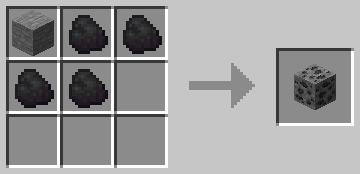
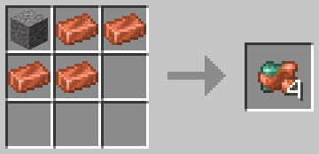

# CraftOres
This data pack adds multiple new recipes to craft all ore block variants, and for copper, gold, and iron, craft the raw versions.

# Table of Contents
- [CraftOres](#craftores)
- [Table of Contents](#table-of-contents)
- [How to craft?](#how-to-craft)
  - [Ores](#ores)
  - [Raw Metals](#raw-metals)
- [Install](#install)
  - [Singleplayer](#singleplayer)
    - [At the creation of a world](#at-the-creation-of-a-world)
    - [In an existing world](#in-an-existing-world)
  - [Multiplayer](#multiplayer)
- [Issues and ideas](#issues-and-ideas)
- [Credits](#credits)

# How to craft?

## [Ores](https://minecraft.fandom.com/wiki/Ore "Ore")
The amount of items you need to craft is bound to the maximum amount of drops you can get from that ore block, using a pickaxe with [Fortune](https://minecraft.fandom.com/wiki/Fortune#Ore "Fortune - Ore") III. All crafting recipes are shapeless, meaning you don't have to put the items in specific spots to craft the ore blocks.

All crafting recipes require a base block, [stone](https://minecraft.fandom.com/wiki/Stone "Stone"), [deepslate](https://minecraft.fandom.com/wiki/Deepslate "Deepslate"), or in some cases, [netherrack](https://minecraft.fandom.com/wiki/Netherrack "Netherrack").

For more information on how to craft ore blocks, you can check [`howtocraft.md#ore-blocks`](howtocraft.md#ore-blocks)

## [Raw Metals](https://minecraft.fandom.com/wiki/Raw_Metal "Raw Metal")
[Raw copper](https://minecraft.fandom.com/wiki/Raw_Copper "Raw Copper"), [gold](https://minecraft.fandom.com/wiki/Raw_Gold "Raw Gold"), and [iron](https://minecraft.fandom.com/wiki/Raw_Iron "Raw Iron") are crafted using 4 ingots and one gravel.

For more information on how to craft raw metals, you can check [`howtocraft.md#raw-metals`](howtocraft.md#raw-metals)

# [Install](https://minecraft.fandom.com/wiki/Tutorials/Installing_a_data_pack "Installing a data pack")
## [Singleplayer](https://minecraft.fandom.com/wiki/Tutorials/Installing_a_data_pack#Singleplayer "Installing a data pack - Singleplayer")
### [At the creation of a world](https://minecraft.fandom.com/wiki/Tutorials/Installing_a_data_pack#At_the_creation_of_a_world "Installing a data pack - Singleplayer - At the creation of a world")
Here is how to install a data pack when creating a singleplayer world:
1. Open *Minecraft*.
2. Create a new world and click `Data Packs`.
3. Drag the data pack into the *Minecraft* window. It should be a `.zip` file or directory.
4. Click `Yes` on the confirmation screen.
5. Move the data pack to the right hand side of the screen by clicking the triangle on its icon.
6. Click `Done` and continue creating your world, then click on `Create New World`.
7. If the data pack has a correct format, it would be enabled in the world. If you have [enabled cheats](https://minecraft.fandom.com/wiki/Commands#Usage "Commands - Usage"), you can verify by typing [`/datapack list enabled`](https://minecraft.fandom.com/wiki/Commands/datapack "Commands/datapack") and find an entry named `[file/datapack name]`.

### [In an existing world](https://minecraft.fandom.com/wiki/Tutorials/Installing_a_data_pack#In_an_existing_world "Installing a data pack - Singleplayer - Existing world")
Here is how to install a data pack in an existing singleplayer world:
1. Open *Minecraft*.
2. Select the world you want to install the data pack for, click on `Edit`, then `Open world folder`.
3. Open the folder named `datapacks`, and put the data pack into it. It should be a `.zip` file or directory.
4. Type [`/reload`](https://minecraft.fandom.com/wiki/Commands/reload) (if you have [enabled cheats](https://minecraft.fandom.com/wiki/Commands#Usage "Commands - Usage")) or press [`F3`+`T`](https://minecraft.fandom.com/wiki/Debug_screen#More_debug-keys "Debug screen - More debug keys") if you are in the world during the installation.
5. If the data pack has a correct format, it would be enabled in the world. If you have enabled cheats, you can verify by typing [`/datapack list enabled`](https://minecraft.fandom.com/wiki/Commands/datapack "Commands/datapack") and find an entry named `[file/datapack name]`.
6. If it doesn't work then reload *Minecraft*.

## [Multiplayer](https://minecraft.fandom.com/wiki/Tutorials/Installing_a_data_pack#Multiplayer "Installing a data pack - Multiplayer")
Here is how to install a data pack when in multiplayer:
1. Download the data pack. It should be a `.zip` file or directory.
2. Open your server folder, then open the folder of the world you wish to install the data pack in (default: `world`).
3. Put the data pack into a folder named `datapacks`.
4. Type [`/reload`](https://minecraft.fandom.com/wiki/Commands/reload "Commands/reload") from the console or as a level 3 [operator](https://minecraft.fandom.com/wiki/Server#Managing_and_maintaining_a_server "Server - Managing and maintaining a server") if the server was running during the installation.
5. If the data pack has a correct format, it would be enabled on the server. You can verify by typing [`/datapack list enabled`](https://minecraft.fandom.com/wiki/Commands/datapack "Commands/datapack") from the consoloe or as a level 3 [operator](https://minecraft.fandom.com/wiki/Server#Managing_and_maintaining_a_server "Server - Managing and maintaining a server") and find an entry named `[file/datapack name]`.

# Issues and ideas
If you are experiencing any issues with the data pack or just want to suggest and idea you thought of, you can create a [new issue](https://github.com/lajawi/craftores/issues/new "Create new issue")

# [Credits](CREDITS.txt)
I woulnd't have been able to make this pack without any third parties involved, so you can find those in [`CREDITS.txt`](CREDITS.txt) or listed below.

CraftCorals: Thanks to [Vanilla Tweaks](https://vanillatweaks.net/ "Vanilla Tweaks") for heavy inspiration.