# How to craft?<!-- omit in toc -->

- [Ore Blocks](#ore-blocks)
  - [Diamond ore](#diamond-ore)
  - [Emerald ore](#emerald-ore)
  - [Iron ore](#iron-ore)
  - [Nether quartz ore](#nether-quartz-ore)
  - [Coal Ore](#coal-ore)
  - [Copper Ore](#copper-ore)
  - [Nether Gold Ore](#nether-gold-ore)
  - [Lapis Lazuli Ore](#lapis-lazuli-ore)
  - [Redstone Ore](#redstone-ore)
- [Raw Metals](#raw-metals)
  - [Raw Copper](#raw-copper)
  - [Raw Gold](#raw-gold)
  - [Raw Iron](#raw-iron)
- [Coral Blocks](#coral-blocks)
  - [Coral Blocks](#coral-blocks-1)
  - [Dead Coral Blocks](#dead-coral-blocks)
  - [Combine coral and coral fans](#combine-coral-and-coral-fans)
- [Amethyst Shards](#amethyst-shards)

## Ore Blocks

The amount of items you need to craft is bound to the maximum amount of drops you can get from that ore block, using a pickaxe with [Fortune](https://minecraft.fandom.com/wiki/Fortune#Ore "Fortune - Ore") III. All crafting recipes are shapeless, meaning you don't have to put the items in specific spots to craft the ore blocks.

All crafting recipes require a base block, [stone](https://minecraft.fandom.com/wiki/Stone "Stone"), [deepslate](https://minecraft.fandom.com/wiki/Deepslate "Deepslate"), or in some cases, [netherrack](https://minecraft.fandom.com/wiki/Netherrack "Netherrack").

For most ore blocks, you need 4 ore items. These include:

### [Diamond ore](https://minecraft.fandom.com/wiki/Diamond_Ore "Diamond Ore")
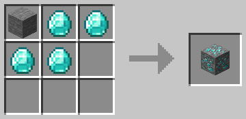

### [Emerald ore](https://minecraft.fandom.com/wiki/Emerald_Ore "Emerald Ore")
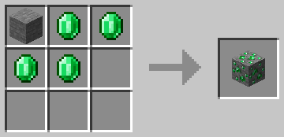

### [Iron ore](https://minecraft.fandom.com/wiki/Iron_Ore "Iron Ore")
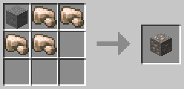

### [Nether quartz ore](https://minecraft.fandom.com/wiki/Nether_Quartz_Ore "Nether Quartz Ore")
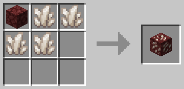

### [Coal Ore](https://minecraft.fandom.com/wiki/Coal_Ore "Coal Ore")
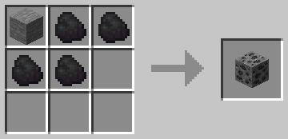

Coal ore is a special one, as it can be crafted using [charcoal](https://minecraft.fandom.com/wiki/Charcoal "Charcoal") too:

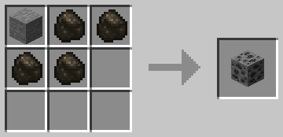

Even combining [coal](https://minecraft.fandom.com/wiki/Coal "Coal") and [charcoal](https://minecraft.fandom.com/wiki/Charcoal "Charcoal") is possible:

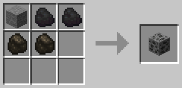

---
And then you have:

### [Copper Ore](https://minecraft.fandom.com/wiki/Copper_Ore "Copper Ore")
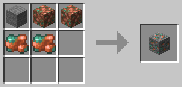

### [Nether Gold Ore](https://minecraft.fandom.com/wiki/Nether_Gold_Ore "Nether Gold Ore")
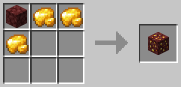

### [Lapis Lazuli Ore](https://minecraft.fandom.com/wiki/Lapis_Lazuli_Ore "Lapis Lazuli Ore")
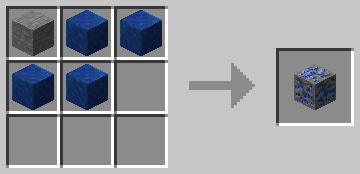

### [Redstone Ore](https://minecraft.fandom.com/wiki/Redstone_Ore "Redstone Ore")
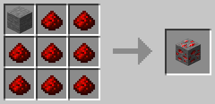

## Raw Metals
[Raw copper](https://minecraft.fandom.com/wiki/Raw_Copper "Raw Copper"), [gold](https://minecraft.fandom.com/wiki/Raw_Gold "Raw Gold"), and [iron](https://minecraft.fandom.com/wiki/Raw_Iron "Raw Iron") are crafted using 4 ingots and one gravel.

### [Raw Copper](https://minecraft.fandom.com/wiki/Raw_Copper "Raw Copper")
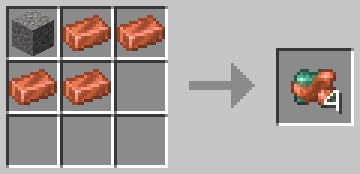

### [Raw Gold](https://minecraft.fandom.com/wiki/Raw_Gold "Raw Gold")
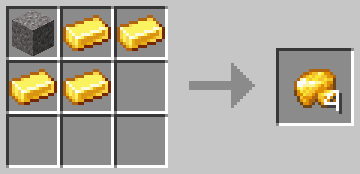

### [Raw Iron](https://minecraft.fandom.com/wiki/Raw_Iron "Raw Iron")
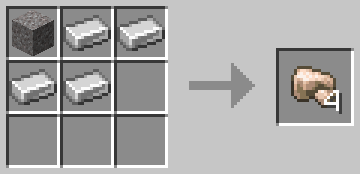

## [Coral Blocks](https://minecraft.fandom.com/wiki/Coral_Block "Coral Block")
[Coral blocks](https://minecraft.fandom.com/wiki/Coral_Block "Coral Block") can be crafted using 4 corals or coral fans, arranged in a squrae. They can be combined.

### [Coral Blocks](https://minecraft.fandom.com/wiki/Coral_Block "Coral Block")
Arrange 4 corals of the same type in a square, either coral or coral fans, to craft a block of the same type.

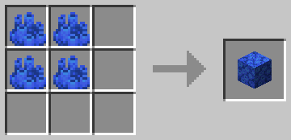

### [Dead Coral Blocks](https://minecraft.fandom.com/wiki/Coral_Block#Dead_coral_blocks "Dead coral blocks")
The same applies for crafting *dead* coral blocks, but with the dead variants.

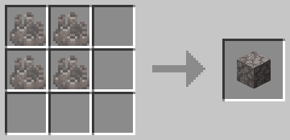

### Combine coral and coral fans
You can also combine both normal coral and coral fans however you like, you will still be able to craft both coral and dead coral blocks.

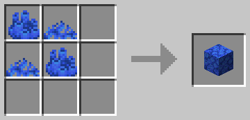

## [Amethyst Shards](https://minecraft.fandom.com/wiki/Amethyst_Shard "Amethyst Shard")
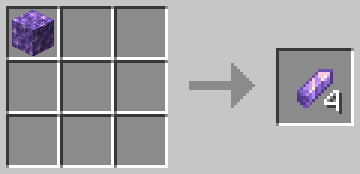
